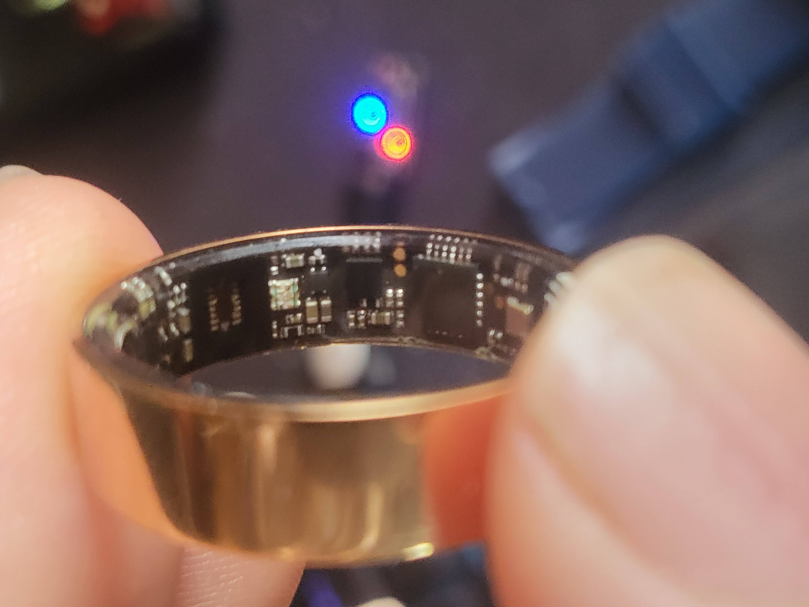

# smartring

**A cloud-free Home Assistant integration for cheap Lefun-protocol BLE smart rings — plus the room-presence lighting system built on top of it.**

[](LICENSE)


This started as *"can I talk to this $10 ring without the ad-ware vendor app?"* and turned
into a whole-home, identity-aware **follow-me lighting** system. Everything runs locally —
no cloud, no vendor app, no phone required.

📖 **[Project site & write-up →](https://jphein.github.io/smartring/)**

<p align="center"></p>

## The ring

**[Ti-Vision Smart Fitness Ring](https://www.amazon.com/dp/B0FQTKLSWR)** — ~$9.99, listed as
*"titanium"* (it is, in fact, cheerfully plastic), pairs with the *Lefun Health / Life* app. Advertised as *"Health Monitoring with **Sleep
Tracking**, Blood Pressure, Heart Rate."* Spoiler: sleep tracking needs an accelerometer,
and [there isn't one](#the-headline-finding-) — but heart rate, SpO₂ and a blood-pressure
estimate are all real, and that's plenty to build presence lighting on.

---

## What's in here

| Component | What it does |
|---|---|
| **`lefun_ring.py`** | Standalone Python CLI + library for the ring's native BLE GATT protocol (HR / SpO₂ / BP / battery / device info). Zero HA required. |
| **`custom_components/lefun_ring/`** | Full Home Assistant integration — routes through HA's Bluetooth stack (local adapter *or* ESPHome BLE proxies), exposes sensors + services + real-time room tracking. |
| **`ha-packages/lefun_ring.yaml`** | The **presence lighting** engine: fused occupancy + follow-me automation + per-room toggles + helper scripts. |
| **`dashboard/`** | Lovelace dashboards — the ring, and the BLE-proxy fleet. |

## The headline finding 🔬

The vendor app advertises steps, sleep, and "shake for camera/find-phone" gestures.
**None of them work — because this ring has no functional accelerometer.** After exhaustive
testing (steps stuck at 0 through every protocol path, zero shake events across minutes of
violent shaking with the camera gesture armed, and a `find-phone` opcode that streams on a
fixed timer regardless of motion), the verdict is clear:

> Every **optical** feature works (heart rate, SpO₂, blood-pressure estimate). Every
> **motion** feature is dead. The firmware is generic Lefun code flashed onto hardware that
> only carries the PPG die — so it *advertises* the step/sleep/gesture opcodes but has
> nothing to feed them.

That single fact reshaped the project: with no shake-button to catch, there was no reason to
hold a persistent BLE connection — so the ring is left free to **advertise**, which is exactly
what makes room tracking possible.

## Follow-me lighting

The room you walk into turns its lights **on**; the room you leave turns **off**.

<p align="center"></p>

Occupancy for each room is **fused** from up to three independent estimators, whichever
fires first:

```
   ring advert ─▶ nearest-proxy tracker (custom, recency-weighted) ┐
   ring advert ─▶ Bermuda BLE trilateration                        ├─▶ room occupancy ─▶ that HA
   mmWave      ─▶ ESPHome radar presence (instant, identity-blind) ┘      (OR-fused)      area's
                                                                                     button_lights
```

- **BLE (ring):** knows *who* (identity), covers every room, but is slow — a cheap ring
  advertises sparsely (~once/minute when idle) and can't wake on motion. Two independent
  BLE estimators (a custom nearest-proxy tracker **and** [Bermuda](https://github.com/agittins/bermuda))
  run in parallel; first to resolve the room wins.
- **mmWave radar (optional):** instant and holds while you sit still, but identity-blind.
  Plug one into a room and that room upgrades to sub-second response automatically — no
  config change. *(The reference deployment currently runs on the ring's adverts alone;
  the radar inputs are wired and waiting.)*
- **Self-healing:** each room manages *itself* (no cross-room reconcile), lights fire only on
  the occupancy **rising edge**, so a manually-darkened room stays dark, and a room left lit
  by a missed transition is cleaned up on the next event. Optional "only when dark" gate.

The result degrades gracefully at every layer: radar down → BLE carries it; one BLE tracker
glitches → the other covers; ring out of range → the room simply clears.

**Hardware requirement:** room tracking needs **[Bluetooth proxies](https://esphome.io/components/bluetooth_proxy.html)**
— one per room you want tracked. This is well-trodden Home Assistant territory: any ESPHome
node with `bluetooth_proxy:` enabled works, and the proxies can do double duty (this house
runs a fleet of **ESP32-C3** devkits that simultaneously proxy adverts, hold iTag button
connections, and bridge BLE battery monitors).

## Hardware findings (unit probed: `FF:2A:35:A7:44:F3`)

- **SoC:** Nordic nRF-class — exposes the genuine Nordic Secure DFU service `0xFE59`. Likely a
  PhyPlus nRF-clone, the family Gadgetbridge's Lefun driver targets.
- **Data protocol:** Gadgetbridge **Lefun** — service `0x18D0`, write `0x2D01`, notify `0x2D00`,
  request preamble `0xAB`, response `0x5A`, bit-wise CRC8, big-endian payloads.
- **Optical (works):** heart rate, SpO₂, single-value blood-pressure estimate (PPG `0x0F`→`0x10`).
- **Motion (dead):** steps `0x12`/`0x13`, sleep `0x15`, shake gestures `0x0A`/`0x0E` — no IMU.
- **Quirks:** DIS strings gated (`NotPermitted` — get identity via cmd `0x00`); power-saves hard;
  a *connected* ring stops advertising (the tracking-vs-connection tradeoff).

## Install

### CLI (standalone)

```bash
python3 -m venv .venv
.venv/bin/pip install -r requirements.txt

# one-time bond
bluetoothctl --timeout 15 scan on
bluetoothctl pair <RING_MAC> && bluetoothctl trust <RING_MAC>

# read live data
.venv/bin/python lefun_ring.py --address <RING_MAC> hr
.venv/bin/python lefun_ring.py --address <RING_MAC> poll
```

### Home Assistant — via HACS (recommended)

[](https://my.home-assistant.io/redirect/hacs_repository/?owner=jphein&repository=smartring&category=integration)

Or manually: **HACS → ⋮ → Custom repositories** → add `https://github.com/jphein/smartring`
(type: *Integration*) → install **Lefun Smart Ring** → restart HA.

### Home Assistant — manual

1. Copy `custom_components/lefun_ring/` into your HA `config/custom_components/`.
2. Restart HA → **Settings → Devices & Services → Add Integration → "Lefun Ring"**
   (auto-discovers via any Bluetooth adapter or ESPHome proxy).
3. For follow-me lighting: drop `ha-packages/lefun_ring.yaml` in your `packages/`, label the
   lights in each room with the `button_lights` label, and toggle rooms on from the dashboard.
4. Import a dashboard from `dashboard/` (storage-mode Lovelace YAML).

See [`custom_components/lefun_ring/README.md`](custom_components/lefun_ring/README.md) for
integration details.

## Credits & license

- Protocol ported from the **[Gadgetbridge](https://codeberg.org/Freeyourgadget/Gadgetbridge)**
  Lefun driver. Room trilateration by **[Bermuda](https://github.com/agittins/bermuda)**.
- Because the protocol code derives from Gadgetbridge (AGPL-3.0), this project is licensed
  **[AGPL-3.0](LICENSE)**.

*Not affiliated with Lefun. "Lefun" is used only to identify the protocol these rings speak.*
